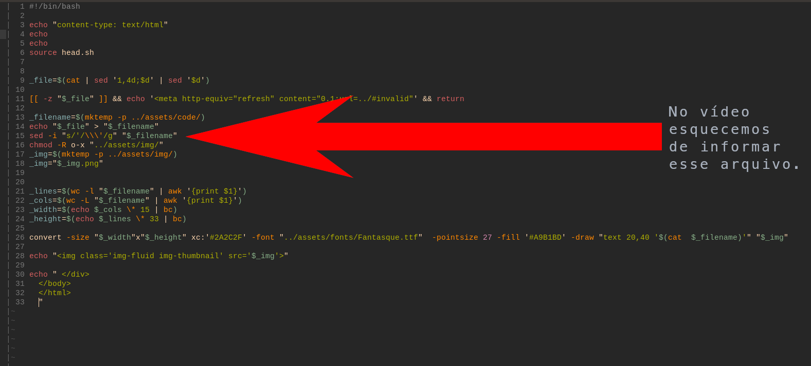

# code2img
Aplicativo Web que transforma código em imagem

A única alteração do conteúdo criado no vídeo é na **linha 15** que eu esqueci de informar o arquivo **`$_filename`** em `sh/index.sh` qque ficou assim: `sed -i "s/'/\\\'/g"` , por isso o código foi transformado sem interpretação das partes com *aspas simples* , mas alterei e deixei assim:
```sh
sed -i "s/'/\\\'/g" "$_filename"
```

# Vídeo do tutorial
# <https://youtu.be/q-nDkg1PauE>

# Imagens geradas pelo app

`my-code.py`


---

`main.cpp`


---

`routing.js`


---

`enable-cgi.sh`


# Interfaces



---


---


# [Terminal Root](https://terminalroot.com.br/)
